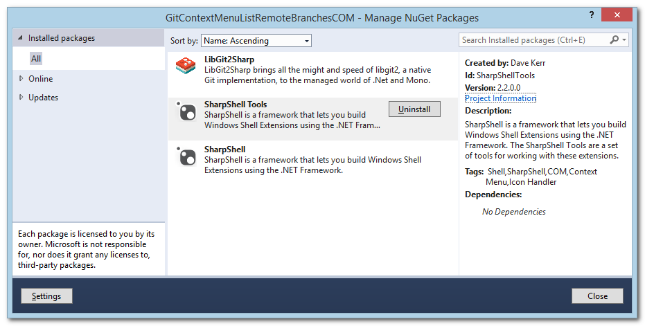
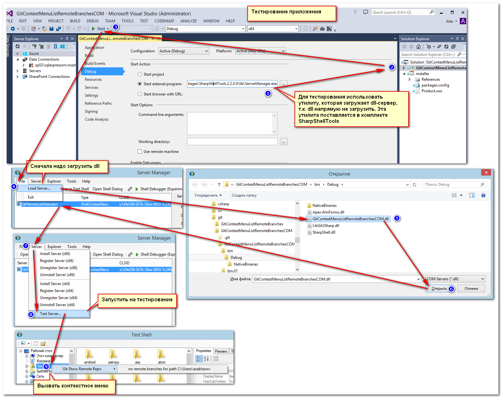

# GitContextMenuListRemoteBranchesCOM

open git remote branches from windows context menu (C#, Windows 8, 8.1, 10, Net 4.5, Visual Studio 2013)

Дополнительные компоненты:

## Контекстное меню со списком удалённых репозиториев для git-репозитория

Выводит в контекстном меню список http(s)-адресов и переходит на них при нажатии на каталог с репозиторием

## Результат:

## Установка (install)

1. Клонировать (Clone):

2. Запустить solution (Start solution):

3. Запустить пересборку (Start rebuild)

4. Теперь можно запустить установку msi-пакета (Now you can run install an msi package)

Теперь программа готова к работе. Открывайте каталог с репозиторием удобным способом и пользуйтесь.

5. При деинсталляция пакета остаются заблокированными пути установки сервера. Для разблокировки нужно перезапустить explorer.exe (Program path is blocked on uninstall. You should restart explorer.exe on Task Manager and remove application path):

После этого каталог установки можно удалить вручную.

## Ручное удаление (manual install/uninstall application)

"C:\Program Files (x86)\GitContextMenuListRemoteBranchesCOM\srm.exe" uninstall "C:\Program Files (x86)\GitContextMenuListRemoteBranchesCOM\GitContextMenuListRemoteBranchesCOM.dll"

## Ручная установка:
	
"C:\Program Files (x86)\GitContextMenuListRemoteBranchesCOM\srm.exe" uninstall "C:\Program Files (x86)\GitContextMenuListRemoteBranchesCOM\GitContextMenuListRemoteBranchesCOM.dll"

## Запуск приложения в отладочном режиме

Приложение можно запустить без установки сервера компонента. В документе http://www.codeproject.com/Articles/512956/NET-Shell-Extensions-Shell-Context-Menus написано, что
нельзя запустить компонент, т.к. он не является исполняемой программой. Но если запустить программу, которая загрузит dll, то на самом деле можно.
Делается это так:

