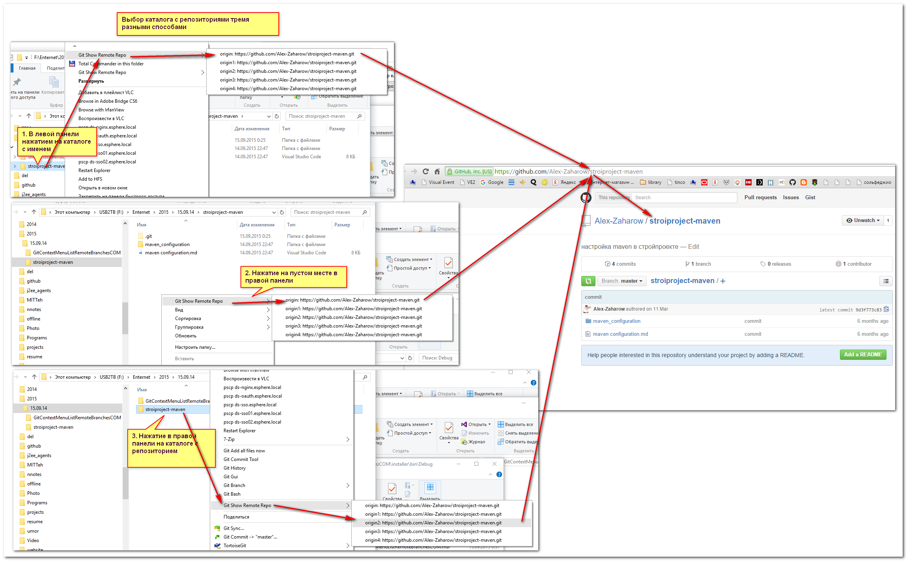

# GitContextMenuListRemoteBranchesCOM
Created Tuesday 15 September 2015

Контекстное меню со списком удалённых репозиториев для git-репозитория
======================================================================

Выводит в контекстном меню список http(s)-адресов и переходит на них при нажатии на каталог с репозиторием

Результат:
==========

Установка
=========

1. Клонировать:

2. Запустить solution:

3. Запустить пересборку

4. Теперь можно запустить установку msi-пакета

Теперь программа готова к работе. Открывайте каталог с репозиторием удобным способом и пользуйтесь.

5. При деинсталляция пакета остаются заблокированными пути установки сервера. Для разблокировки нужно перезапустить explorer.exe:

После этого каталог установки можно удалить вручную.

Ручное удаление
===============

"C:\Program Files (x86)\GitContextMenuListRemoteBranchesCOM\srm.exe" uninstall "C:\Program Files (x86)\GitContextMenuListRemoteBranchesCOM\GitContextMenuListRemoteBranchesCOM.dll"

Ручная установка:
=================
	
"C:\Program Files (x86)\GitContextMenuListRemoteBranchesCOM\srm.exe" uninstall "C:\Program Files (x86)\GitContextMenuListRemoteBranchesCOM\GitContextMenuListRemoteBranchesCOM.dll"

